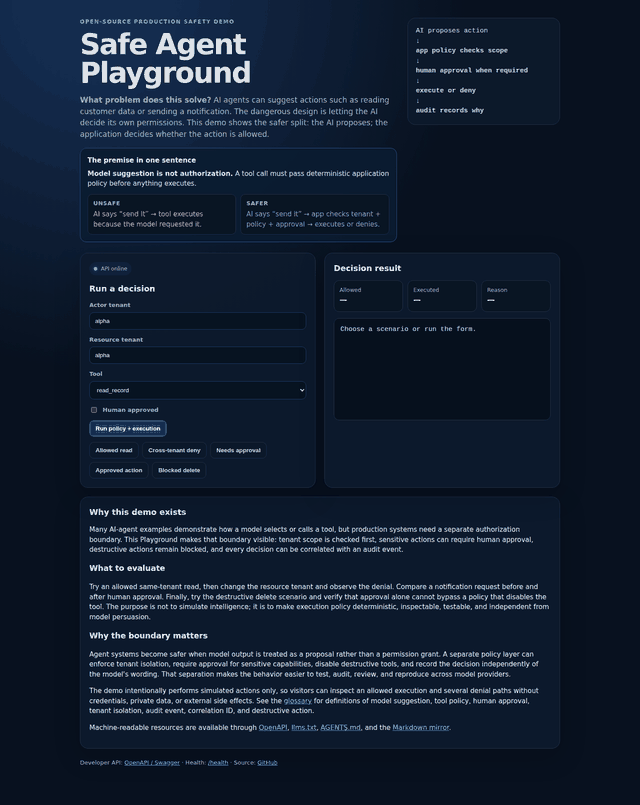
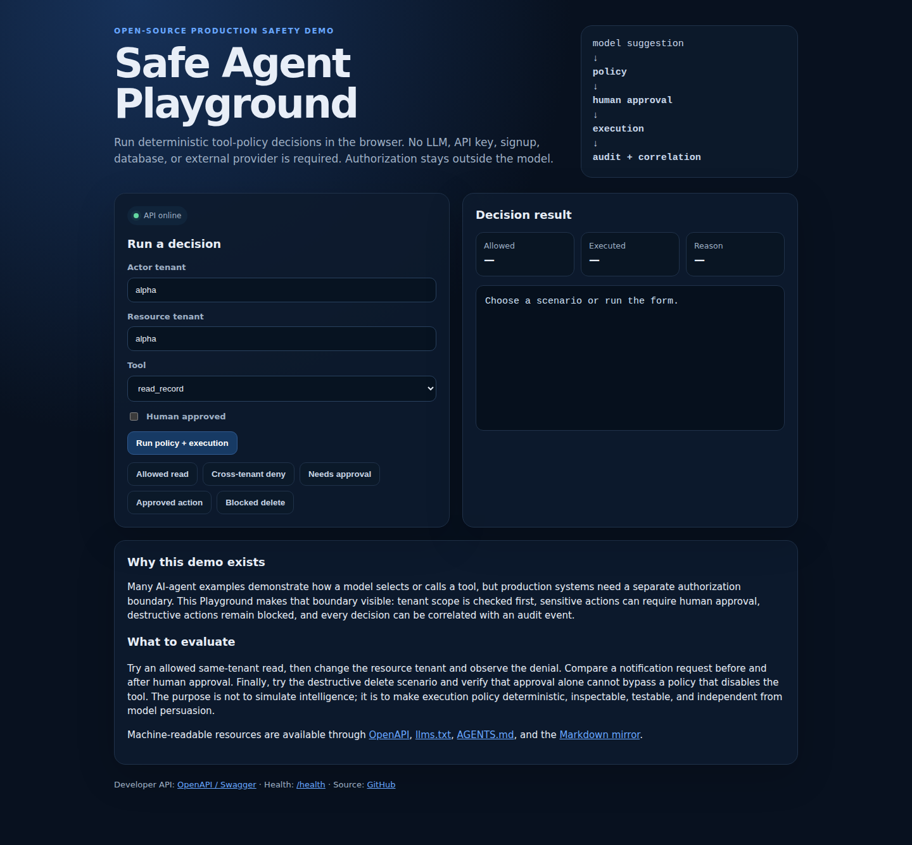

<p align="center"></p>

# AI Agent Production Checklist

<p align="center">
  <a href="https://github.com/Videirafo/AI-Agent-Production-Checklist/actions"></a>
  <a href="https://github.com/Videirafo/AI-Agent-Production-Checklist/actions/workflows/demo-assets.yml"></a>
  <a href="./LICENSE"></a>
  
</p>

**Checklist + aplicação executável para projetar, avaliar, proteger e operar agentes de IA em produção.**

## O problema em linguagem simples

Um agente de IA pode sugerir ações como **ler um registro**, **enviar uma notificação** ou **chamar uma ferramenta**. O desenho perigoso é deixar o próprio modelo decidir se tem permissão para executar o que sugeriu.

A regra demonstrada aqui é simples:

> **Model suggestion is not authorization.** O modelo propõe a ação; a aplicação verifica tenant, policy e aprovação humana antes de executar ou negar.

| Fluxo | Exemplo |
|---|---|
| ❌ Inseguro | `AI diz “envie” → ferramenta executa porque o modelo pediu` |
| ✅ Mais seguro | `AI diz “envie” → aplicação verifica escopo + policy + approval → executa ou nega` |

O Playground existe para tornar essa separação **visível, testável e auditável**, sem depender de um LLM real.

## 🚀 Live Demo

**[Open the Safe Agent Playground →](https://safe-agent-playground.onrender.com/)**

- Playground: https://safe-agent-playground.onrender.com/
- OpenAPI / Swagger: https://safe-agent-playground.onrender.com/docs
- Health: https://safe-agent-playground.onrender.com/health

> Hosted on Render Free. The service may cold-start after an idle period.

| Status | Projeto executável | Qualidade |
|---|---|---|
| `v0.6` | **Safe Agent Playground + API** | GitHub Actions · pytest · CodeQL · Docker · Codespaces · verified browser demo · Render live |

`agentic-ai` · `guardrails` · `tool-calling` · `RAG` · `MCP` · `evals` · `observability` · `security`

## Veja o Playground em segundos

<p align="center">
  <a href="https://safe-agent-playground.onrender.com/"></a>
</p>

O GIF acima não é mockup: o workflow **Verified Demo Assets** inicia a FastAPI real, abre o Playground em Chromium com Playwright, executa cenários de autorização e gera os frames usados na animação.

<details>
<summary><strong>Abrir screenshot completo verificado</strong></summary>
<br />
<p align="center"></p>
</details>

## Use agora

### Sem instalar nada

Abra **https://safe-agent-playground.onrender.com/** e execute os cinco cenários no navegador.

### 1 clique: GitHub Codespaces

[](https://codespaces.new/Videirafo/AI-Agent-Production-Checklist?quickstart=1)

O Codespace instala as dependências, inicia a FastAPI e encaminha a porta `8000`. A tela aberta é o **Safe Agent Playground**, que usa a API real do projeto.

### Deploy da sua própria cópia

[](https://vercel.com/new/clone?repository-url=https%3A%2F%2Fgithub.com%2FVideirafo%2FAI-Agent-Production-Checklist&root-directory=examples%2Fsafe-agent-api&project-name=safe-agent-api&repository-name=safe-agent-api)

Também existe um `render.yaml` na raiz para deploy via Render Blueprint.

### Docker local

```bash
git clone https://github.com/Videirafo/AI-Agent-Production-Checklist.git
cd AI-Agent-Production-Checklist/examples/safe-agent-api
docker compose up --build
```

Abra:

- Playground: `http://localhost:8000/`
- OpenAPI / Swagger: `http://localhost:8000/docs`
- Health: `http://localhost:8000/health`

## O que você consegue testar

A interface oferece cenários prontos que chamam `POST /v1/run-demo`:

| Cenário | Resultado esperado |
|---|---|
| same-tenant `read_record` | permitido e executado |
| cross-tenant `read_record` | negado por `tenant_mismatch` |
| `send_notification` sem aprovação | negado e pede aprovação humana |
| `send_notification` aprovado | permitido, executado e auditado |
| `delete_record` | bloqueado mesmo com aprovação |

Fluxo demonstrado:

```text
MODEL SUGGESTION
→ DETERMINISTIC POLICY
→ HUMAN APPROVAL
→ EXECUTION
→ STRUCTURED AUDIT EVENT
→ CORRELATION ID
```

A autorização acontece **fora do modelo**. O LLM pode sugerir uma ação; ele não concede a si mesmo permissão para executá-la.

## Segurança da demo pública

- nenhum LLM, API key ou banco externo;
- nenhuma ação real de envio ou exclusão;
- tools são determinísticas e simuladas;
- tenant IDs e request IDs têm tamanho limitado;
- a UI usa a mesma API server-side, sem duplicar policy em JavaScript;
- CSP, `nosniff`, `no-referrer` e `no-store` na página pública;
- testes cobrem isolamento, approval gate, destructive denial, auditoria e UI pública.

## Rodar no VS Code / Python

```bash
git clone https://github.com/Videirafo/AI-Agent-Production-Checklist.git
cd AI-Agent-Production-Checklist/examples/safe-agent-api
python -m venv .venv
# Linux/macOS: source .venv/bin/activate
# Windows PowerShell: .venv\Scripts\Activate.ps1
pip install -e ".[dev]"
pytest
fastapi dev app/main.py
```

## Ajude sem escrever código

Queremos validar a experiência com pessoas que não construíram este repositório.

**[Executar a aplicação e reportar fricção de setup →](https://github.com/Videirafo/AI-Agent-Production-Checklist/issues/17)**

Para quem prefere contribuir com código:

**[Good first issue: JSONL audit sink →](https://github.com/Videirafo/AI-Agent-Production-Checklist/issues/16)**

## Conteúdo técnico

- [Safe Agent API / Playground](./examples/safe-agent-api/README.md)
- [Checklist completo](./docs/CHECKLIST.md)
- [Threat model](./docs/THREAT_MODEL.md)
- [RAG, memória e isolamento](./docs/RAG_MEMORY.md)
- [Evals e observabilidade](./docs/EVALS_OBSERVABILITY.md)
- [Production readiness](./templates/PRODUCTION_READINESS_CHECKLIST.md)
- [Tool policy template](./templates/TOOL_POLICY_TEMPLATE.md)
- [Threat model template](./templates/THREAT_MODEL_TEMPLATE.md)
- [Render deployment](./docs/DEPLOY_RENDER.md)
- [Launch kit](./docs/LAUNCH.md)

## Contribua

Issues, testes, novas policies e exemplos de guardrails são bem-vindos. Leia [CONTRIBUTING.md](./CONTRIBUTING.md) antes de abrir um PR.

Se este projeto for útil:

- dê uma **Star** para facilitar a descoberta;
- use **Watch → Releases** para acompanhar versões relevantes;
- abra uma Issue com um cenário real de agent safety que você gostaria de ver coberto.

## Segurança e privacidade

Nunca publique credenciais, `.env`, private keys, IPs internos, conversa privada, dados de clientes ou código proprietário. Consulte [SECURITY.md](./SECURITY.md).

## Licença

Distribuído sob a [MIT License](./LICENSE).

---

Criado por [Fernando Videira](https://github.com/Videirafo) como base pública para engenharia de agentes de IA em produção.
