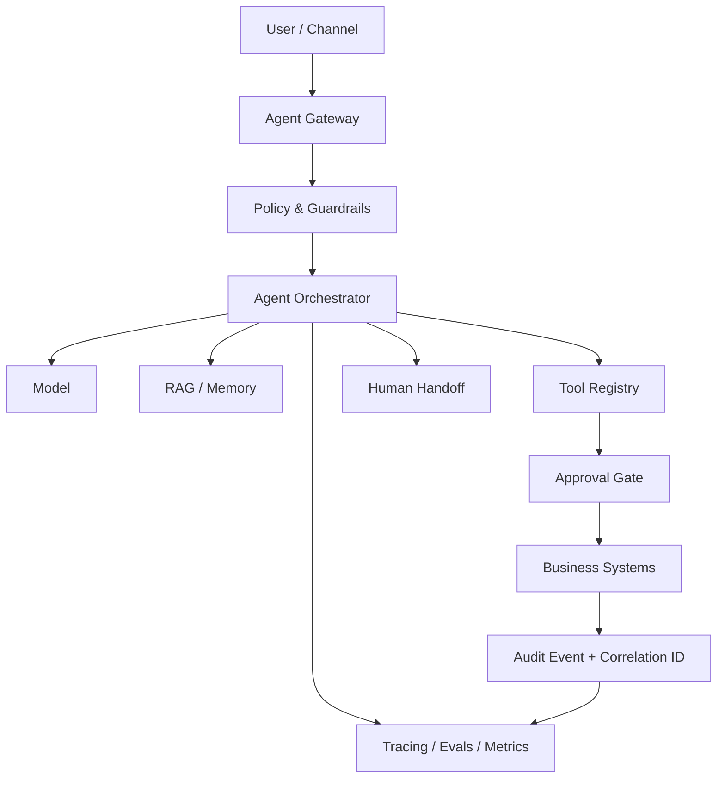

<p align="center"></p>

# AI Agent Production Checklist

<p align="center">
  <a href="https://github.com/Videirafo/AI-Agent-Production-Checklist/actions"></a>
  <a href="./LICENSE"></a>
  
</p>

**Checklist + API executável para projetar, avaliar, proteger e operar agentes de IA em produção.**

| Status | Projeto executável | Qualidade |
|---|---|---|
| `v0.4` | **Safe Agent API** | GitHub Actions · pytest · CodeQL · Docker · audit correlation |

`agentic-ai` · `guardrails` · `tool-calling` · `RAG` · `MCP` · `evals` · `observability` · `security`

## Comece em 60 segundos

### Docker

```bash
git clone https://github.com/Videirafo/AI-Agent-Production-Checklist.git
cd AI-Agent-Production-Checklist/examples/safe-agent-api
docker compose up --build
```

Abra `http://localhost:8000/docs` para testar a API via OpenAPI/Swagger.

### VS Code / Python

```bash
git clone https://github.com/Videirafo/AI-Agent-Production-Checklist.git
cd AI-Agent-Production-Checklist/examples/safe-agent-api
python -m venv .venv
# Linux/macOS: source .venv/bin/activate
# Windows PowerShell: .venv\Scripts\Activate.ps1
pip install -e ".[dev]"
pytest
fastapi dev app/main.py
```

No VS Code também estão disponíveis **Run and Debug** e tasks para servidor e testes.

**[Abrir o Safe Agent API →](./examples/safe-agent-api/README.md)**

## Ajude sem escrever código

Queremos validar a experiência com pessoas que não construíram este repositório. Clone, execute a Safe Agent API e diga onde a configuração ficou confusa.

**[Testar o quickstart e enviar feedback →](https://github.com/Videirafo/AI-Agent-Production-Checklist/issues/17)**

Para quem prefere contribuir com código, há também uma tarefa pequena e isolada para implementar um audit sink JSONL.

**[Good first issue: JSONL audit sink →](https://github.com/Videirafo/AI-Agent-Production-Checklist/issues/16)**

## O que a demo prova

A API implementa uma camada determinística de policy antes da execução de tools. Não exige LLM nem API key.

| Tool | Política determinística |
|---|---|
| `read_record` | permitida somente no mesmo tenant |
| `send_notification` | exige aprovação humana |
| `delete_record` | bloqueada no exemplo |

O fluxo `POST /v1/run-demo` também retorna um **audit event estruturado**. O `correlation_id` é derivado do `request_id`, permitindo ligar decisão, execução e diagnóstico operacional sem armazenar conversa privada.

Endpoints:

- `GET /health`
- `POST /v1/tool-check`
- `POST /v1/run-demo`
- documentação OpenAPI em `/docs`

Os testes verificam same-tenant access, cross-tenant denial, approval gate, bloqueio destrutivo e correlação de auditoria para ações permitidas e negadas.

## Modelo de produção

```text
USE CASE
→ RISK CLASSIFICATION
→ DATA & IDENTITY
→ TOOL POLICY
→ GUARDRAILS
→ RAG / MEMORY
→ EVALS
→ HUMAN APPROVAL
→ EXECUTION
→ AUDIT + CORRELATION
→ TRACE
→ INCIDENT RESPONSE
→ IMPROVE
```



## Checklist essencial

### Identidade & tools
- [ ] tenant/usuário resolvidos antes da execução;
- [ ] menor privilégio e schemas estritos;
- [ ] argumentos validados;
- [ ] tools destrutivas protegidas por policy/approval;
- [ ] outputs de tools tratados como dados não confiáveis.

### Prompt injection & dados
- [ ] conteúdo recuperado não sobrescreve system policy;
- [ ] instruções em páginas/arquivos são input não confiável;
- [ ] autorização crítica acontece fora do prompt;
- [ ] saída de modelo é validada antes de SQL/shell/URL/payload executável.

### Evals & operação
- [ ] dataset de regressão;
- [ ] task success, tool selection e argumentos avaliados;
- [ ] testes de segurança/autorização;
- [ ] tracing, custo, latência e taxa de erro observáveis;
- [ ] audit event correlacionado por execução crítica;
- [ ] handoff humano e kill switch disponíveis.

## Conteúdo técnico

- [Checklist completo](./docs/CHECKLIST.md)
- [Threat model](./docs/THREAT_MODEL.md)
- [RAG, memória e isolamento](./docs/RAG_MEMORY.md)
- [Evals e observabilidade](./docs/EVALS_OBSERVABILITY.md)
- [Production readiness](./templates/PRODUCTION_READINESS_CHECKLIST.md)
- [Tool policy template](./templates/TOOL_POLICY_TEMPLATE.md)
- [Threat model template](./templates/THREAT_MODEL_TEMPLATE.md)
- [Projetos executáveis](./examples/README.md)

## Contribua

Issues, testes, novas policies e exemplos de guardrails são bem-vindos. Leia [CONTRIBUTING.md](./CONTRIBUTING.md) antes de abrir um PR.

Se este projeto for útil para seu trabalho:

- dê uma **Star** para facilitar que outras pessoas o encontrem;
- use **Watch → Releases** para acompanhar versões relevantes;
- abra uma Issue com um cenário real de agent safety que você gostaria de ver coberto.

## Segurança e privacidade

Nenhuma credencial, `.env`, IP interno, conversa privada, dado de cliente ou código proprietário deve ser publicado. Consulte [SECURITY.md](./SECURITY.md).

## Licença

Distribuído sob a [MIT License](./LICENSE).

---

Criado por [Fernando Videira](https://github.com/Videirafo) como base pública para engenharia de agentes de IA em produção.
