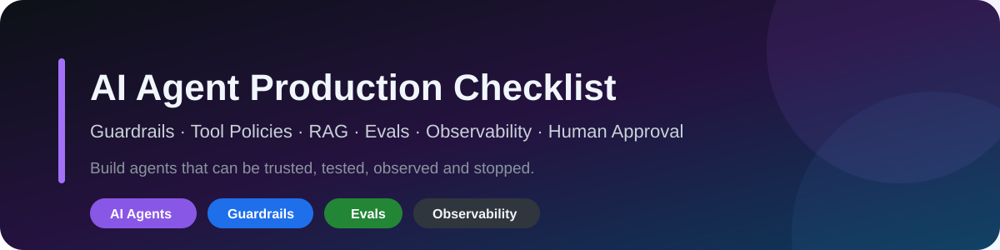
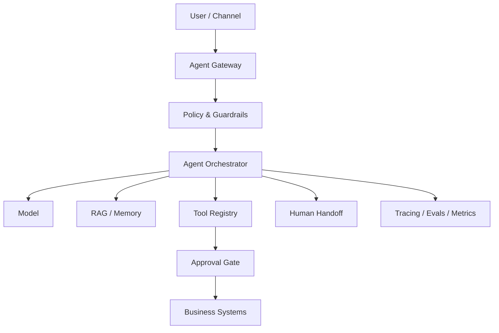

<p align="center"></p>

# AI Agent Production Checklist

**Checklist + API executável para projetar, avaliar, proteger e operar agentes de IA em produção.**

| Status | Projeto executável | Qualidade |
|---|---|---|
| `v0.2` | **Safe Agent API** | GitHub Actions · pytest · docs quality · secret scan |

`agentic-ai` · `guardrails` · `tool-calling` · `RAG` · `MCP` · `evals` · `observability` · `security`

## Clone & Run no VS Code

O `Safe Agent API` demonstra políticas de tools **sem precisar de LLM ou API key**:

```bash
git clone https://github.com/Videirafo/AI-Agent-Production-Checklist.git
cd AI-Agent-Production-Checklist/examples/safe-agent-api
code .
```

Crie o ambiente virtual, instale `.[dev]` e use o próprio VS Code:

- **Run and Debug → `Agent API: debug FastAPI`**;
- **Tasks → `Agent API: dev server`**;
- **Tasks → `Agent API: pytest`**.

**[Abrir o Safe Agent API →](./examples/safe-agent-api/README.md)**

### Políticas demonstradas

| Tool | Política determinística |
|---|---|
| `read_record` | permitida somente no mesmo tenant |
| `send_notification` | exige aprovação humana |
| `delete_record` | bloqueada no exemplo |

Endpoints:

- `GET /health`
- `POST /v1/tool-check`
- `POST /v1/run-demo`
- documentação OpenAPI em `/docs`

Os testes verificam same-tenant access, cross-tenant denial, approval gate e bloqueio de ação destrutiva.

## Modelo de produção

```text
USE CASE
→ RISK CLASSIFICATION
→ DATA & IDENTITY
→ TOOL POLICY
→ GUARDRAILS
→ RAG / MEMORY
→ EVALS
→ HUMAN APPROVAL
→ DEPLOY
→ TRACE
→ INCIDENT RESPONSE
→ IMPROVE
```



## Checklist essencial

### Identidade & tools

- [ ] tenant/usuário resolvidos antes da execução;
- [ ] menor privilégio;
- [ ] schemas estritos;
- [ ] argumentos validados;
- [ ] tools destrutivas protegidas por policy/approval;
- [ ] outputs de tools tratados como dados não confiáveis.

### Prompt injection & dados

- [ ] conteúdo recuperado não sobrescreve system policy;
- [ ] instruções em páginas/arquivos são input não confiável;
- [ ] autorização crítica acontece fora do prompt;
- [ ] saída de modelo é validada antes de SQL/shell/URL/payload executável.

### Evals & operação

- [ ] dataset de regressão;
- [ ] task success, tool selection e argumentos avaliados;
- [ ] testes de segurança/autorização;
- [ ] tracing, custo, latência e taxa de erro observáveis;
- [ ] handoff humano e kill switch disponíveis.

## Conteúdo técnico

- [Checklist completo](./docs/CHECKLIST.md)
- [Threat model](./docs/THREAT_MODEL.md)
- [RAG, memória e isolamento](./docs/RAG_MEMORY.md)
- [Evals e observabilidade](./docs/EVALS_OBSERVABILITY.md)
- [Production readiness](./templates/PRODUCTION_READINESS_CHECKLIST.md)
- [Tool policy template](./templates/TOOL_POLICY_TEMPLATE.md)
- [Threat model template](./templates/THREAT_MODEL_TEMPLATE.md)
- [Projetos executáveis](./examples/README.md)

## Git workflow

```bash
git checkout -b feat/minha-policy
# altere e rode pytest no VS Code
git add .
git commit -m "feat: add agent tool policy"
git push -u origin feat/minha-policy
```

Consulte [CONTRIBUTING.md](./CONTRIBUTING.md).

## Segurança e privacidade

Nenhuma credencial, `.env`, IP interno, conversa privada, dado de cliente ou código proprietário deve ser publicado. Consulte [SECURITY.md](./SECURITY.md).

---

Criado por [Fernando Videira](https://github.com/Videirafo) como base pública para engenharia de agentes de IA em produção.
