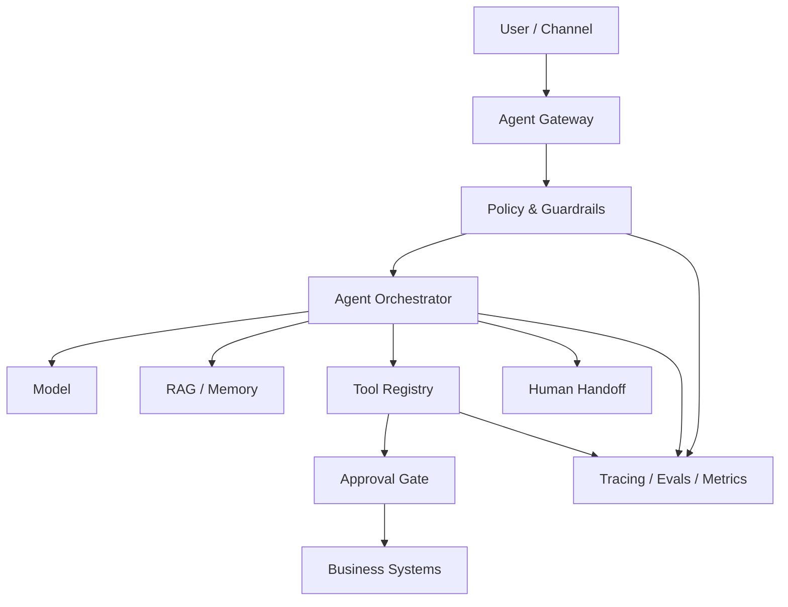

<div align="center">

# AI Agent Production Checklist

### Build agents that can be trusted, tested, observed and stopped.

**Checklist público para projetar, avaliar, proteger e operar agentes de IA em produção.**

`agentic-ai` · `guardrails` · `tool-calling` · `RAG` · `MCP` · `evals` · `observability` · `security`

</div>

---

## Por que este projeto existe

Um agente de IA em produção não é apenas um prompt com acesso a ferramentas. Ele combina **modelo, instruções, memória, retrieval, tools, permissões, ações externas, dados, avaliações e operação**.

O objetivo deste repositório é transformar esse risco em uma sequência verificável:

```text
USE CASE
→ RISK CLASSIFICATION
→ DATA & IDENTITY
→ TOOL POLICY
→ GUARDRAILS
→ RAG / MEMORY
→ EVALS
→ HUMAN APPROVAL
→ DEPLOY
→ TRACE
→ INCIDENT RESPONSE
→ IMPROVE
```

## Arquitetura de referência



## Checklist rápido

### 1. Caso de uso e risco

- [ ] existe objetivo e limite explícito do agente;
- [ ] ações irreversíveis estão identificadas;
- [ ] dados sensíveis e regulados estão classificados;
- [ ] existe owner humano pelo fluxo;
- [ ] existe critério claro para não usar IA.

### 2. Identidade e autorização

- [ ] cada ação ocorre no contexto do usuário/tenant correto;
- [ ] o agente recebe o menor privilégio necessário;
- [ ] leitura e escrita usam permissões separadas quando possível;
- [ ] tokens não são passados entre serviços sem validação de audience;
- [ ] tools críticas exigem autorização determinística fora do prompt.

### 3. Tools e agency

- [ ] tool schema é estrito e validado;
- [ ] argumentos são validados antes da execução;
- [ ] tools não necessárias não ficam expostas;
- [ ] operações destrutivas exigem approval gate;
- [ ] existe limite de chamadas, custo e tempo;
- [ ] outputs de tools são tratados como dados não confiáveis.

### 4. Prompt injection e dados não confiáveis

- [ ] conteúdo recuperado não pode sobrescrever política do sistema;
- [ ] instruções presentes em páginas, arquivos e mensagens são tratadas como input não confiável;
- [ ] ações não são autorizadas apenas porque um documento pediu;
- [ ] saída do modelo é validada antes de virar SQL, shell, URL ou payload executável.

### 5. RAG e memória

- [ ] retrieval respeita tenant/ACL;
- [ ] chunks carregam origem e metadados;
- [ ] existe política de retenção e deleção;
- [ ] memória persistente não armazena secrets;
- [ ] respostas importantes preservam evidência/citação quando aplicável.

### 6. Evals

- [ ] existe dataset de casos reais e regressões;
- [ ] task success é medido;
- [ ] tool selection e tool arguments são avaliados;
- [ ] segurança e autorização fazem parte dos testes;
- [ ] mudanças de modelo/prompt/tool executam regressão antes do deploy.

### 7. Human-in-the-loop

- [ ] baixa confiança ou alto impacto gera handoff;
- [ ] approvals mostram ao humano a ação e os argumentos;
- [ ] existe cancelamento/kill switch;
- [ ] o agente sabe quando parar.

### 8. Observabilidade

- [ ] `request_id`, `conversation_id` e `tenant_id` são rastreáveis quando aplicável;
- [ ] tool calls e decisões de policy geram eventos;
- [ ] latência, erro, custo e tokens são monitorados;
- [ ] traces não expõem dados sensíveis sem necessidade;
- [ ] existe runbook para incidentes.

## Principais riscos que este checklist combate

| Risco | Controle principal |
|---|---|
| Prompt injection | separar política de conteúdo não confiável + autorização fora do modelo |
| Excessive agency | least privilege + approvals + limites de tools |
| Sensitive data disclosure | classificação, minimização, redaction e retenção |
| Cross-tenant leakage | ACL/tenant filters no retrieval, tools e storage |
| Hallucinated actions | schemas, validação e confirmações determinísticas |
| Tool abuse | allowlist, rate limits, audit log e idempotência |
| Silent regressions | eval suites + golden cases + canary/rollback |
| Unobservable failures | tracing, metrics, logs e incident runbooks |

## Conteúdo

- [Checklist completo](./docs/CHECKLIST.md)
- [Threat model para agentes](./docs/THREAT_MODEL.md)
- [RAG, memória e isolamento](./docs/RAG_MEMORY.md)
- [Evals e observabilidade](./docs/EVALS_OBSERVABILITY.md)
- [Production readiness](./templates/PRODUCTION_READINESS_CHECKLIST.md)
- [Tool policy template](./templates/TOOL_POLICY_TEMPLATE.md)
- [Threat model template](./templates/THREAT_MODEL_TEMPLATE.md)

## Referências técnicas

Este starter é vendor-neutral, mas acompanha fontes primárias e padrões de segurança:

- NIST AI Risk Management Framework e Generative AI Profile;
- OWASP GenAI / LLM Top 10;
- OpenAI Agents SDK — tools, guardrails, approvals, sessions e tracing;
- Model Context Protocol — authorization e security considerations.

## Segurança e privacidade

Este repositório não publica credenciais, `.env`, IPs internos, conversas privadas, dados de clientes ou código proprietário. Consulte [SECURITY.md](./SECURITY.md).

## Contribuindo

Mudanças devem melhorar a capacidade de **verificar** um agente, e não apenas adicionar buzzwords.

```text
Issue → branch → evidência → mudança → validação → PR → review → merge
```

Consulte [CONTRIBUTING.md](./CONTRIBUTING.md).

## Status

**v0.1 — foundation.** O próximo passo é adicionar exemplos executáveis e uma pequena suite de evals genérica.

---

Criado por [Fernando Videira](https://github.com/Videirafo) como parte de uma base pública de engenharia de software e AI Agents.
